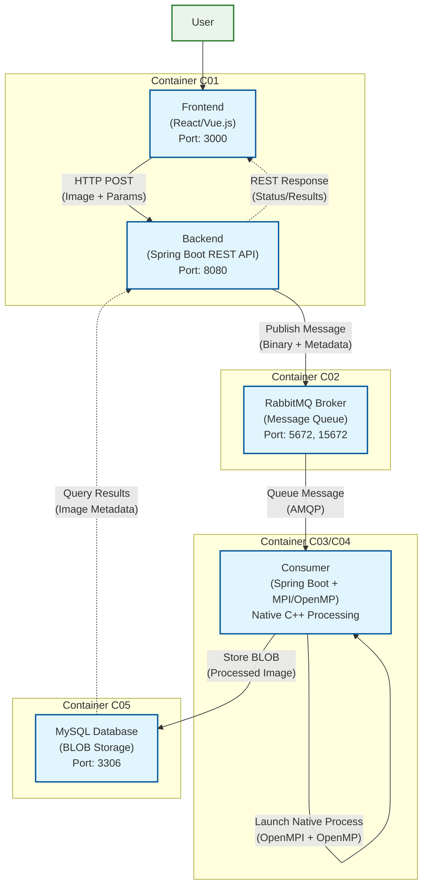

# Cryptoflow - Distributed Image Encryption/Decryption System

A high-performance, containerized system for encrypting and decrypting large BMP images using AES symmetric encryption with distributed processing via OpenMPI and OpenMP.

## Architecture Overview

The system consists of 5 Docker containers working together to provide a complete image processing pipeline:

- **C01 Frontend**: React/Vue.js web interface for uploading images and parameters
- **C01 Backend**: Spring Boot REST API with RabbitMQ publisher
- **C02 Message Broker**: RabbitMQ for asynchronous message processing
- **C03/C04 Consumer**: Spring Boot consumer with OpenMPI/OpenMP native processing
- **C05 Database**: MySQL for storing processed images



## Features

### Core Functionality
- **AES Encryption**: Supports AES-256 in ECB and CBC modes
- **Large File Processing**: Handles files up to 100MB
- **Parallel Processing**: OpenMPI for distribution + OpenMP for multi-threading
- **Real-time Updates**: WebSocket notifications for processing status
- **Persistent Storage**: MySQL BLOB storage for processed images

### Technical Stack
- **Frontend**: React/Vue.js with TypeScript
- **Backend**: Spring Boot 3.5.0 with Java 17
- **Message Queue**: RabbitMQ 3.x
- **Database**: MySQL 8.0
- **Crypto Engine**: C++ with OpenSSL, OpenMPI, OpenMP
- **Containerization**: Docker & Docker Compose

## System Requirements

### Prerequisites
- Docker Desktop 4.0+
- Docker Compose 2.0+
- Minimum 8GB RAM (recommended 16GB for large images)
- Multi-core CPU (recommended 4+ cores)

### Supported Platforms
- macOS Apple Silicon (arm64)

## Installation & Setup

### 1. Clone Repository
```bash
git clone <repository-url>
cd cryptoflow
```

### 2. Environment Configuration
Create `.env` file in project root:
```env
# RabbitMQ Configuration
RABBITMQ_HOST=rabbitmq
RABBITMQ_PORT=5672
RABBITMQ_USER=cryptoflow
RABBITMQ_PASSWORD=cryptoflow

# MySQL Configuration
MYSQL_HOST=mysql
MYSQL_PORT=3306
MYSQL_DATABASE=cryptoflow
MYSQL_USER=cryptoflow
MYSQL_PASSWORD=cryptoflow
```

### 3. Build and Start Services
```bash
# Build all containers
docker-compose build

# Start all services
docker-compose up -d

# View logs
docker-compose logs -f
```

### 4. Verify Installation
- Frontend: http://localhost:3000
- Backend API: http://localhost:8080
- RabbitMQ Management: http://localhost:15672
- MySQL: localhost:3306

## Architecture Details

### Container Specifications

#### C01 - Frontend & Backend
- **Frontend**: React/Vue.js SPA served via Nginx
- **Backend**: Spring Boot REST API
- **Responsibilities**:
  - File upload handling (multipart/form-data)
  - Parameter validation
  - Message publishing to RabbitMQ
  - SWR fetching

#### C02 - RabbitMQ Message Broker
- **Image**: rabbitmq:3-management
- **Queues**: `cryptoflow.processing`
- **Exchanges**: Direct exchange for routing
- **Management UI**: Port 15672

#### C03/C04 - Processing Consumers  
- **Base**: Ubuntu 22.04 with OpenMPI/OpenMP
- **Components**:
  - Spring Boot consumer application
  - Native C++ crypto processor
  - OpenMPI for distributed processing
  - OpenMP for parallel thread execution

#### C05 - MySQL Database
- **Image**: mysql:8.0
- **Schema**: 
  ```sql
  CREATE TABLE processed_images (
    id VARCHAR(36) PRIMARY KEY,
    image_name VARCHAR(255),
    processed_data LONGBLOB,
    operation VARCHAR(50),
    encryption_mode VARCHAR(50),
    processed_at TIMESTAMP
  );
  ```

### Parallel Processing Strategy

#### OpenMPI Distribution
- Splits image pixel data across multiple MPI processes
- Each process handles a chunk of the image
- Ensures proper AES block alignment (16-byte boundaries)
- Gathers results from all processes

#### OpenMP Threading
- Within each MPI process, uses all available CPU cores
- Parallel block processing for encryption/decryption
- Optimized for cache locality and memory bandwidth

## Development

### Local Development
```bash
# Backend development
cd backend
mvn spring-boot:run -Dspring-boot.run.profiles=backend

# Consumer development  
mvn spring-boot:run -Dspring-boot.run.profiles=consumer

# Frontend development
cd frontend
npm run dev
```

### Command Line Interface

Direct crypto processor usage:
```bash
# Encrypt with AES-CBC
./crypto_processor encrypt CBC mySecretKey123456 input.bmp encrypted.bmp

# Decrypt with AES-CBC  
./crypto_processor decrypt CBC mySecretKey123456 encrypted.bmp decrypted.bmp

# Encrypt with AES-ECB
./crypto_processor encrypt ECB mySecretKey123456 input.bmp encrypted.bmp
```

## License

This project is developed for academic purposes as part of Web and Cloud Applications Security course. It is not intended for production use. All code is provided "as is" without warranty of any kind.